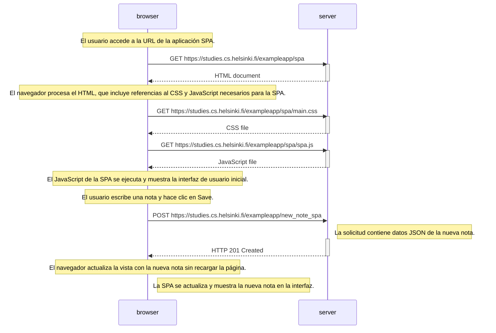

```mermaid 
sequenceDiagram
    participant browser
    participant server

    Note over browser: El usuario accede a la URL de la aplicación SPA.

    browser->>server: GET https://studies.cs.helsinki.fi/exampleapp/spa
    activate server
    server-->>browser: HTML document
    deactivate server

    Note over browser: El navegador procesa el HTML, que incluye referencias al CSS y JavaScript necesarios para la SPA.

    browser->>server: GET https://studies.cs.helsinki.fi/exampleapp/spa/main.css
    activate server
    server-->>browser: CSS file
    deactivate server

    browser->>server: GET https://studies.cs.helsinki.fi/exampleapp/spa/spa.js
    activate server
    server-->>browser: JavaScript file
    deactivate server

    Note over browser: El JavaScript de la SPA se ejecuta y muestra la interfaz de usuario inicial.

    Note over browser: El usuario escribe una nota y hace clic en Save.

    browser->>server: POST https://studies.cs.helsinki.fi/exampleapp/new_note_spa
    Note right of server: La solicitud contiene datos JSON de la nueva nota.
    activate server
    server-->>browser: HTTP 201 Created
    deactivate server

    Note over browser: El navegador actualiza la vista con la nueva nota sin recargar la página.

    Note right of browser: La SPA se actualiza y muestra la nueva nota en la interfaz.
```

