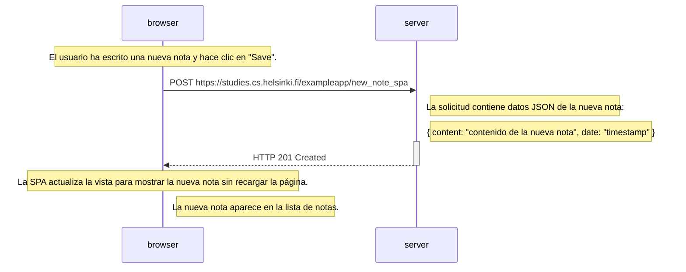

```mermaid
    sequenceDiagram
    participant browser
    participant server

    Note over browser: El usuario ha escrito una nueva nota y hace clic en "Save".

    browser->>server: POST https://studies.cs.helsinki.fi/exampleapp/new_note_spa
    Note right of server: La solicitud contiene datos JSON de la nueva nota:
    Note right of server: { content: "contenido de la nueva nota", date: "timestamp" }
    activate server
    server-->>browser: HTTP 201 Created
    deactivate server

    Note over browser: La SPA actualiza la vista para mostrar la nueva nota sin recargar la página.

    Note right of browser: La nueva nota aparece en la lista de notas.
```