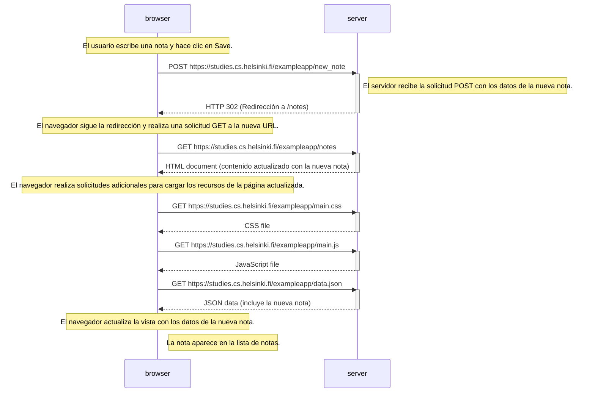

```mermaid
    sequenceDiagram
    participant browser
    participant server

    Note over browser: El usuario escribe una nota y hace clic en Save.

    browser->>server: POST https://studies.cs.helsinki.fi/exampleapp/new_note
    activate server
    Note right of server: El servidor recibe la solicitud POST con los datos de la nueva nota.
    server-->>browser: HTTP 302 (Redirección a /notes)
    deactivate server

    Note over browser: El navegador sigue la redirección y realiza una solicitud GET a la nueva URL.

    browser->>server: GET https://studies.cs.helsinki.fi/exampleapp/notes
    activate server
    server-->>browser: HTML document (contenido actualizado con la nueva nota)
    deactivate server

    Note over browser: El navegador realiza solicitudes adicionales para cargar los recursos de la página actualizada.

    browser->>server: GET https://studies.cs.helsinki.fi/exampleapp/main.css
    activate server
    server-->>browser: CSS file
    deactivate server

    browser->>server: GET https://studies.cs.helsinki.fi/exampleapp/main.js
    activate server
    server-->>browser: JavaScript file
    deactivate server

    browser->>server: GET https://studies.cs.helsinki.fi/exampleapp/data.json
    activate server
    server-->>browser: JSON data (incluye la nueva nota)
    deactivate server

    Note over browser: El navegador actualiza la vista con los datos de la nueva nota.

    Note right of browser: La nota aparece en la lista de notas.
```
